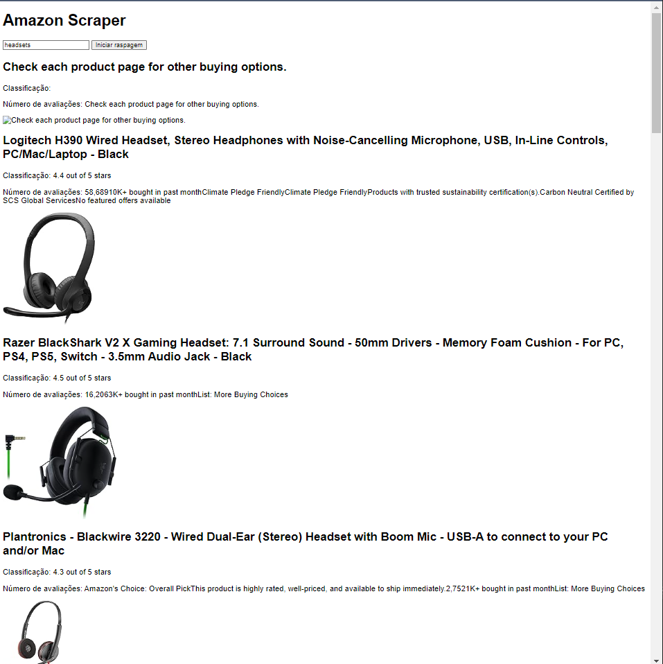

# Amazon Scraper

Script simples para extrair listagens de produtos da Amazon da primeira página de resultados de pesquisa para uma determinada palavra-chave

Este é um raspador da web simples para a Amazon usando Node.js, Express, Axios, Cheerio e AJAX.

## Configuração

    -Clone o repositório
    -Instale as dependências com `npm install`
    -Inicie o servidor com `node app.js`

## Uso

Inicialize a api 'node app.js' . 
Abra o arquivo index.html - Digite uma palavra-chave de pesquisa e clique em: Iniciar raspagem 

Obs. Como é uma resposta assíncrona pode ou nao ter exito na raspagem. Parametro que utilizei nos teste(headsets).

